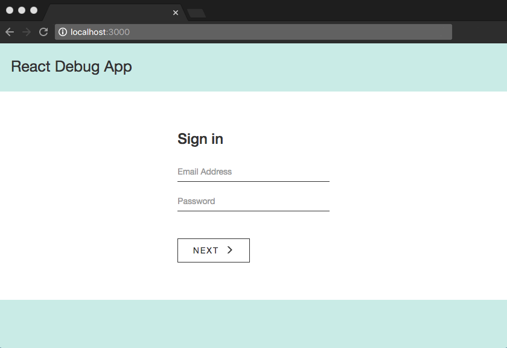
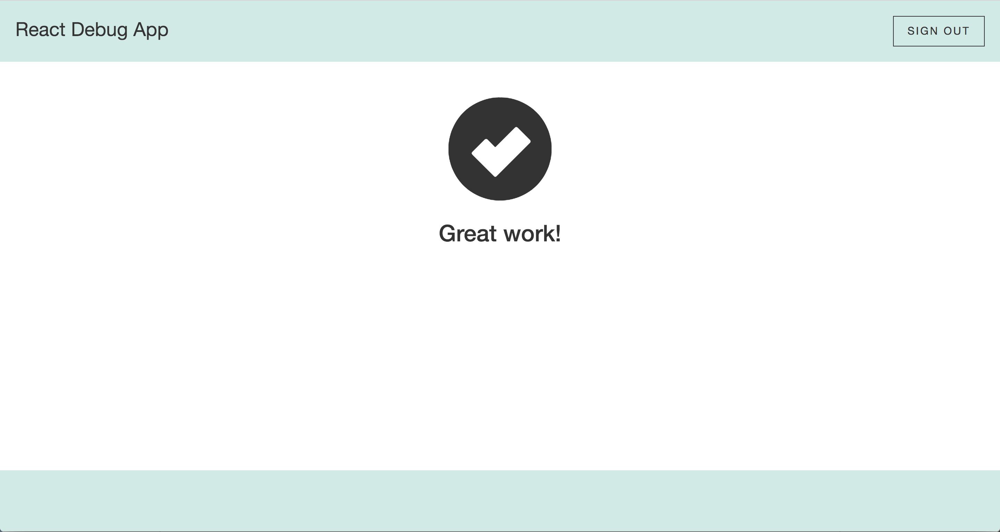

# React Debug Exercise

The code in this app is intentionally broken and created in an older version of React to give you a sense of dealing with legacy code.

Debugging is not only a great way to learn but it's also a valuable skill. Developers are frequently tasked with debugging code, and it's common for developers to debug code that was written by another team member (either past or present).


### Before You Start

You should be able to progress past the sign in form when the code is fixed. Any test login credentials will work (the app has no back end authentication or form validation beyond what's native to the browser). The main view looks like the screenshot below:

<p align='center'>
  
</p>

The final view looks like the following. The Sign Out button should work upon completion and spit you back to the login page.

<p align='center'>
  
</p>

React is easier to debug when you have a solid foundation in [HTML](http://learn.shayhowe.com/html-css/getting-to-know-html/), [CSS](http://learn.shayhowe.com/html-css/getting-to-know-css/) and [JavaScript](https://developer.mozilla.org/en-US/docs/Learn/Getting_started_with_the_web/JavaScript_basics). JSX is also important to learn. [JSX](https://medium.com/javascript-scene/jsx-looks-like-an-abomination-1c1ec351a918#.ro3sx1ea0), an HTML/CSS/JavaScript purée, it not required in React applications but is considered an industry standard.

The SAR method (Situation, Action, Result) is a great method for thinking through the steps needed to solve a problem.

This app includes a lint tool, so many errors will display in the Terminal app (Mac) or Command Prompt (Windows). The JavaScript console in the developer tools menu of any modern browser should also provide assistance.

### Installation

Clone the repository, install dependencies, then start the development server (from the command line or Terminal app).

  ```
    > git clone git@github.com:emauldin84/react-debug-exercise.git
    > cd react-debug-exercise
    > npm install
    > npm start
  ```

Good Luck!🍀
